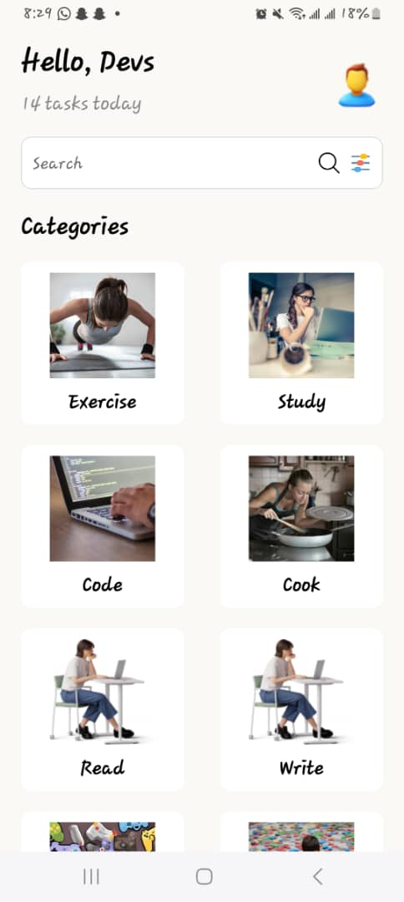
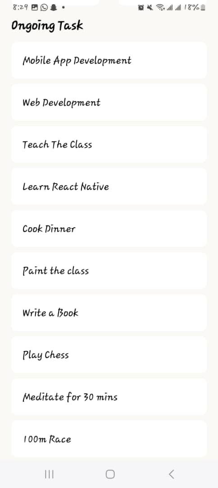

# rn-assignment3-11356687

## An App for Tasks to be done 

A simple task manager app built with React Native. This app allows users to categorize and manage their daily tasks.

## Features

- View and categorize tasks by various categories.
- Search functionality to find specific tasks.
- Filter tasks based on user preferences.
- Easy-to-use interface with a clean design.

### 'App.js'
The main part of the application. Combinations of UI's  for creating a task app.

## Screenshots 

